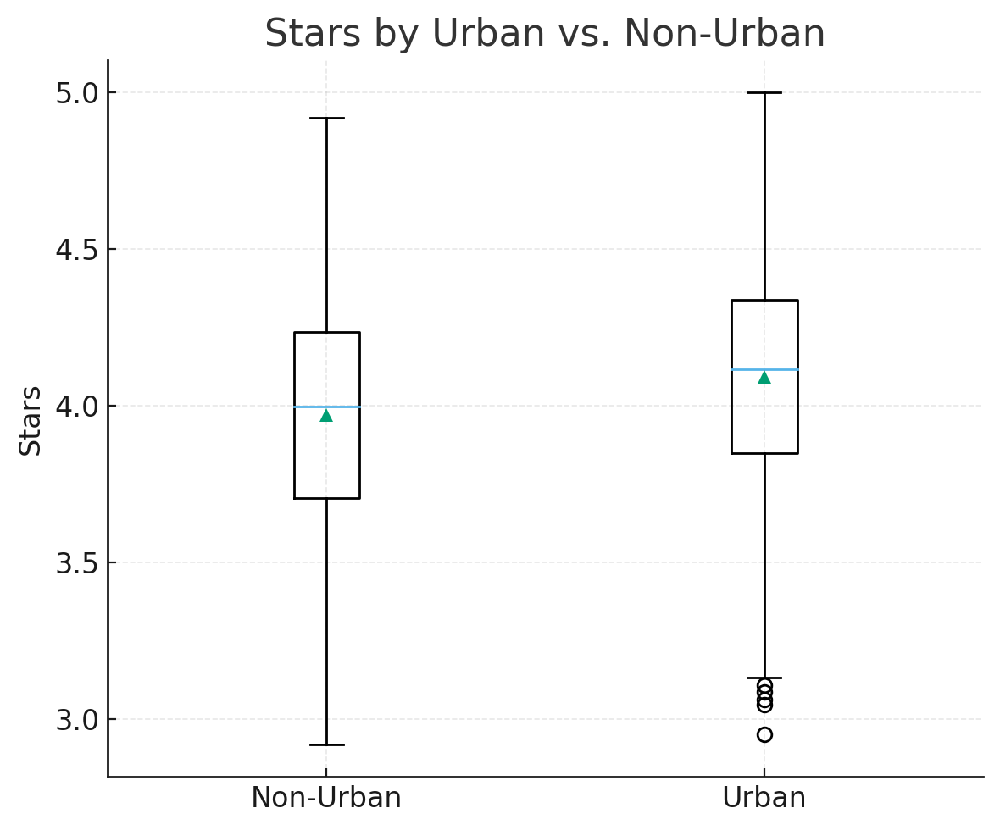

# Yelp Coffee & Tea Analysis (with SQL + NLP)

This project explores the [Yelp Open Dataset](https://www.yelp.com/dataset) with a focus on **Coffee & Tea** businesses.  
The goal: uncover what truly drives customer satisfaction and visibility.  

I combine **SQL + Python** for structured data analysis and **NLP (TF-IDF)** for unstructured review text.  
The result: a reproducible pipeline and interpretable insights about how reputation is shaped.

---

## Dataset & Pipeline

- **Source:** [Yelp Academic Dataset](https://www.yelp.com/dataset)
- **Scope:** Coffee & Tea businesses and their reviews  
- **Stack:** PostgreSQL • SQLAlchemy • pandas • scikit-learn (TF-IDF)  
- **ETL:** JSON → Postgres raw tables → reduced/cleaned tables → analysis & NLP  
- **Sample Data:** This repo ships with small CSV samples so anyone can run the pipeline without the full 9GB dataset.

**Full dataset sizes**
- Businesses: 150,346 total → 6,704 Coffee & Tea  
- Reviews: 6,990,280 total → 442,356 for Coffee & Tea  

**Sample in repo**
- `sample_business.csv` (≈100 rows)  
- `sample_review.csv` (≈300 rows)  
- Stored in `data/raw_data/` and generated by the SQL notebook.  

---

## Key Findings

### 1. Popularity vs. Rating
Shops with more reviews do not suffer rating dilution. In fact, the correlation was **+0.18**, meaning that higher visibility tends to coincide with slightly higher average stars.
- Example:  
  - <50 reviews → avg rating = 3.9★  
  - >500 reviews → avg rating = 4.2★
 
 

---

### 2. Urban vs. Non-Urban
Coffee & Tea businesses in urban areas hold a stronger advantage: higher review counts and slightly higher average ratings. The effect is visible both in distributions and in mean values.
- **Urban shops**: avg rating = 4.15★, ~3× more reviews.  
- **Non-urban shops**: avg rating = 3.95★.  
- Visibility is a key driver: volume and foot traffic matter.  


---

### 3. Amenities & Price
- Amenities such as Wi-Fi, outdoor seating, or even price band had **weak correlations (r ≈ 0.05)** with ratings.  
- In other words, these checklist features don’t explain much variance in satisfaction.  

---

## NLP Insights from Reviews

### Methods
- **Preprocessing:** lowercasing, punctuation removal, stop-word removal, optional lemmatization  
- **Vectorization:** TF-IDF on unigrams & bigrams, filtering rare terms  
- **Labels:** Positive (≥4★) vs. Negative (≤2★) review buckets  
- **Inspection:** Compare distinctive TF-IDF terms across buckets  

### Findings
- **Positive reviews:** emphasize taste and hospitality  
  - *coffee, espresso, latte, delicious, friendly, staff, cozy, ambiance*  
  - TF-IDF weight in ≥4★ reviews ~0.025 vs. <0.005 in ≤2★  

- **Negative reviews:** dominated by operational friction  
  - *order, time, minutes, wait, line, drive-thru, wrong, cold*  
  - TF-IDF weight in ≤2★ reviews ~0.030 vs. <0.006 in ≥4★  

- **Distinctive Terms by Rating Bucket**
  
Term contrasts (TF-IDF): In ≥4★ reviews, quality/hospitality terms dominate (e.g., coffee, latte, delicious, friendly, cozy), with average TF-IDF weights around 0.020–0.030 and near-zero weights in the ≤2★ bucket. In ≤2★ reviews, operational friction terms lead (e.g., wait, minutes, line, wrong, cold, drive-thru), with average TF-IDF weights around 0.025–0.035 and near-zero in ≥4★ reviews. This numeric asymmetry supports the claim that execution (speed/accuracy) is the main driver of dissatisfaction, while product + warmth drive praise.

High-rating (≥4★) top terms (avg TF-IDF): coffee (0.028), latte (0.024), delicious (0.022), friendly (0.021)
Low-rating (≤2★) top terms (avg TF-IDF): minutes (0.031), wait (0.029), wrong (0.027), cold (0.026), drive-thru (0.025)

### Interpretation
- **High ratings** are earned through product quality and friendly staff.  
- **Low ratings** are driven by queue management, speed, and accuracy failures.  
- This confirms what SQL analysis suggested: **operations matter more than amenities.**

---

## Prototypes for Practical Metrics

- **Friction Index:** share of tokens linked to ops failures (order, wait, wrong, cold, refund, drive-thru).  
- **PAS (Price- & Attention-Adjusted Satisfaction):** deviation of actual stars from baseline predicted by review count + price band.  

These metrics could be tracked by location or over time to flag “hidden gems” or underperformers.

---

## Limitations & Extensions

- TF-IDF is bag-of-words: no context, sarcasm, or negation.  
- Ratings were bucketed (positive vs. negative), simplifying a continuum.  

**Future directions**
- Aspect-based sentiment (service vs. taste vs. ambiance).  
- Topic modeling (e.g. BERTopic) for richer themes.  
- Transformer sentiment (e.g. DistilBERT) for context/negation.  
- Queue-time features (bigram patterns like *long wait* or *wrong order*).  

---

## How to Reproduce

1. Install [PostgreSQL](https://www.postgresql.org/download/) locally.  
2. Clone this repo and install requirements:  
   ```bash
   pip install -r requirements.txt
3. Open the notebook in notebooks/, update DB password when prompted.
4. Run pipeline with included samples or download the full Yelp dataset.

---

## Repo Structure

```text
yelp-nlp-sql-analysis/
├─ README.md
├─ requirements.txt
├─ notebooks/
│  ├─ analysis_yelp_clean.ipynb
│  └─ make_samples.ipynb
├─ data/
│  └─ raw_data/
│     ├─ sample_business.csv
│     └─ sample_review.csv
├─ images/
│  ├─ stars_vs_review_count.png
│  └─ stars_urban_vs_nonurban.png
```

---

## Takeaway

Reputation in the Coffee & Tea sector is less about amenities or price bands, and more about operational execution:
- speed of service,
- accuracy of orders,
- and staff friendliness.
  
This blend of SQL analysis and NLP insights provides a roadmap for operators to monitor both structured data (ratings, counts) and unstructured text (reviews) in order to surface actionable signals.


